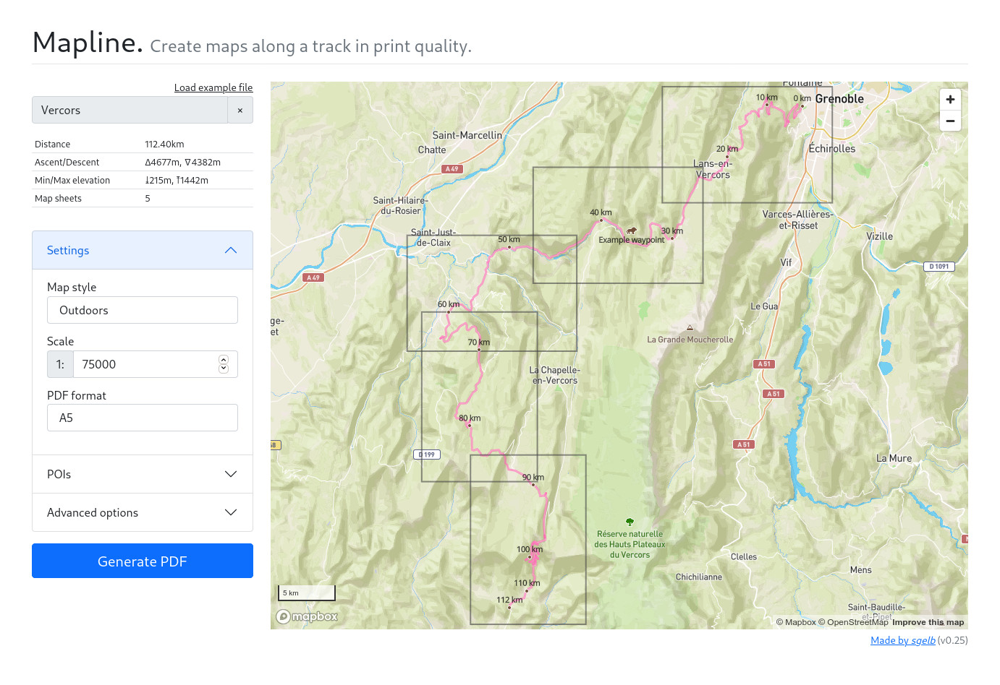

# mapline

Create a collection of accurate maps in print quality along your gpx or kml track, in your scale,
your format and the infos you need.

Create a collection of accurate maps in print quality along your gpx or kml track, in
your scale, your format and the infos you need.

### Adaptations
Compared to the [original](https://github.com/sgelb/mapline) this fork adds
some features that I personally like. For example support for tracks made up
from separate segments in the same file. Or showing alternative routes with a
different style.

### Features
- Accurate scale throughout the whole route
- Printable quality of 300dpi
- Customizable paper format up to A2, page margins and distance markers
- Support of waypoints

Inspired by the [bikeline Cycling guides](http://www.esterbauer.com/international.html) and
[Openstreetmap](https://www.openstreetmap.org/about), this application uses [Mapbox GL
JS](https://www.mapbox.com/mapbox-gl-js/api/) to create the maps I need. Vector tiles enable
rendering in 300dpi, high enough for printing. There are different styles available. Paper format,
page margins and distance markers are customizable. You want a map in 1:85.000 on A5 paper along
that winding river? No problem.

### Waypoints and POIs

Waypoints contained in the GPX can set a symbol name through the optional
[`sym`](https://www.rigacci.org/wiki/doku.php/tecnica/gps_cartografia_gis/gpx) field. You can set
the used icon by specify any [Maki icon](https://www.labs.mapbox.com/maki-icons/) by using their
basename e.g. _campsite-11_ in this field.

Additional POIs can be downloaded via [Overpass](https://wiki.openstreetmap.org/wiki/Overpass_API).
To add more choices, see
[overpass.js](https://github.com/sgelb/mapline/blob/master/src/overpass.js). POIs are downloaded for
print areas only. In case of format or scale changes, manually refresh by toggling the checkboxes.

### Development

Logic and PDF generation of `mapline` are performed client-side. Main external libraries are [Mapbox
GL JS](https://www.mapbox.com/mapbox-gl-js/) for map creation and
[jsPDF](https://github.com/MrRio/jsPDF) for PDF generation.

Before you can use `mapline`, you have to get your own [Mapbox access
token](https://docs.mapbox.com/help/glossary/access-token). Save it in `src/mapboxtoken.js`:

    export default '<your access token here>';

- `yarn install` installs all dependencies
- `yarn run serve` starts a dev server
- `yarn run dist ` generates a production build in `/dist`

### Prebuilds

Since v0.16.0, a bundled version is published for tagged commits in `prebuild/`. See
[prebuild/README.md](https://github.com/sgelb/mapline/blob/master/prebuild/README.md) for more infos
on how to use it.

`yarn run prebuild` prepares all files in `/prebuild`. Finished prebuilds are then generated using
git hooks, see
[git-hooks/README.md](https://github.com/sgelb/mapline/blob/master/git-hooks/README.md) for details.

### Limitations

An application written in Javascript, using WebGL and running entirely in the browser has of course
some limitations.

- [canvas size](https://webglstats.com/webgl/parameter/MAX_RENDERBUFFER_SIZE) and hence the maximum
  page format depend on your graphics card
- at least in the past, Javascript engines had a hardcoded maximum string size. This limited the
  size of the output PDF to
  [~268.44MB](https://github.com/atom/atom/issues/7210#issuecomment-160994222). I do not know where the limits are now.

### Missing features and nice-to-haves

- a map style better suited for cycle tours and printing in black&white
- a scale bar on the printouts
- elevation stats and marking of steep slopes

### Want to participate?

Although development is slow, this is not a dead project and pull-requests are always welcome!

